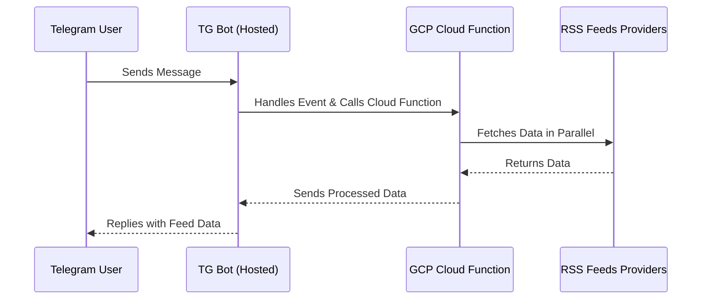
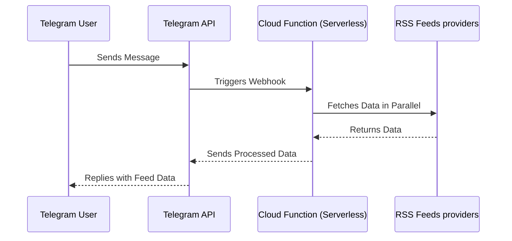

# Web3 Feeds - Firebase Cloud Function & Telegram Bot

This guide provides instructions for setting up the Web3 Feeds project in two configurations:

1. **Hosted Solution**: Deploying a Telegram bot on a server.
2. **Serverless Solution with Telegram Webhook**: Utilizing Firebase Cloud Functions to handle Telegram webhook events.

## Hosted Solution



### 1. Clone the Repository

```bash
git clone https://github.com/2b1q/web3-feeds.git
cd web3-feeds
```

### Firebase Cloud Function - RSS Feed Proxy

#### Setup

1. Clone the repository:
   ```sh
   git clone git@github.com:2b1q/web3-feeds.git
   cd web3-feeds
   ```

2. Initialize Firebase project:
   ```sh
   firebase init functions
   ```
   - Choose **TypeScript**
   - Enable ESLint (N)
   - Select your Firebase project

3. Install dependencies:
   ```sh
   cd functions
   npm install
   ```

#### Deploy Cloud Functions

Deploy the Cloud Functions:
   ```sh
   firebase deploy --only functions
   ```

Make sure to set your API key:
   ```sh
   # Set YOUR_API_KEY
   ```

#### Usage

Make a request using your API key:
   ```sh
   curl -X GET https://us-central1-YOUR_PROJECT_ID.cloudfunctions.net/getAllFeeds \
        -H "Authorization: Bearer YOUR_API_KEY" -s | jq .
   ```

---

### Telegram Bot Setup

#### 1. Create a Telegram Bot

- Open Telegram and search for `@BotFather`
- Start a conversation and run:
  ```sh
  /newbot
  ```
- Follow the instructions to set a bot name and username.
- Copy the provided **bot token**.

#### 2. Configure Environment Variables

Create a `.env` file inside the `bot` directory:
   ```sh
   cd bot
   touch .env
   ```

Add the following:
   ```
   BOT_TOKEN=YOUR_TELEGRAM_BOT_TOKEN
   CF_API_TOKEN=YOUR_API_KEY
   ```

#### 3. Install Dependencies

   ```sh
   cd bot
   npm install
   ```

#### 4. Run the Bot Locally

   ```sh
   node index.js
   ```

#### 5. Deploy the Bot (Optional)

To keep your bot running continuously, deploy it to a server or use a process manager like `pm2`:
   ```sh
   pm2 start index.js --name web3-feeds-bot
   pm2 save
   ```

---

## Serverless Telegram Bot with Cloud Functions



#### Setup Cloud Function as Webhook

1. Deploy your webhook function:

```sh
firebase deploy --only functions:telegramBotWebhook
```

2. Set the Telegram webhook URL:

Replace `YOUR_BOT_TOKEN` and `YOUR_WEBHOOK_URL` with your actual values:

```sh
curl -X GET "https://api.telegram.org/botYOUR_BOT_TOKEN/setWebhook?url=YOUR_WEBHOOK_URL"
```

Example webhook URL:

```
https://us-central1-YOUR_PROJECT_ID.cloudfunctions.net/telegramBotWebhook
```

After successful webhook registration, Telegram will send all updates to your Cloud Function.

---

### Telegram Bot Commands

| Command                | Description |
|------------------------|-------------|
| `/start`               | Get started with the bot |
| `/news`                | Fetch latest 3 news from all providers |
| `/news [provider]`     | Get latest news from a specific provider (`coindesk`, `cointelegraph`, `decrypt`) |
| `/news [provider] [n]` | Get last `n` news items from a provider |
| `/news all [n]`        | Get last `n` news items from all providers |

---
